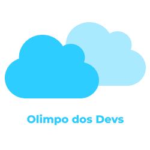

<h1 align="center">
   
</h1>

  

## 💻 Projeto

O Olimpo dos Devs tem como objetivo ensinar os usuários através de podcasts interátivos.
Estes podcasts podem ter os mais diversos tópicos, desde medicina à tecnologia!

Queremos ainda tentar melhorar a expereriência entre professor e aluno através de comentários e votações.

## ⚙️ Requisitos
 - Flutter
 - ADB
 - Vscode ou Andorid Studio
 - Emulador ou Celular Real

## 🚀 Tecnologias utilizadas
 - Flutter

## 🔖 Layout

## ⬇️ Instalação
 - `git clone https://github.com/Bora-Codar/Olimpo-dos-Devs---Backend.git`
 - `cd Olimpo-dos-Devs---Backend`
 - `flutter run`

## 🤔 Como Contribuir
 - Abra uma issue relatando sobre o problema ou pergunte se pode realizar o problema de alguma
 - Crie a branch `git checkout -b <nome-branch>`
 - Adicione suas alterações `git add <nome-dos-arquivos` ou somente `.`
 - Faça seus commit `git commit -m <breve-msg-sobre-alterações>`
 - Faça o push para a sua branch `git push origin <nome-branch>`
 - Faça seu PR, quando seu PR for aceito deleta a branch do repositório.

## :memo: Licença
Esse projeto está sob a licença MIT. Veja o arquivo [LICENSE](LICENSE.md) para mais detalhes.